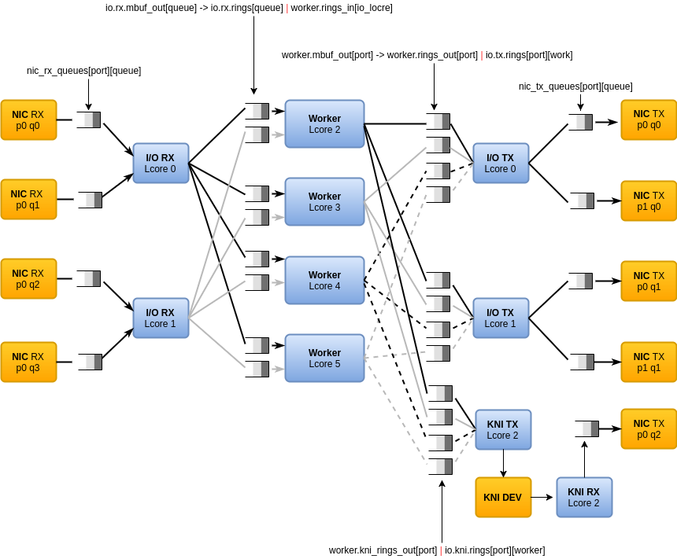

# DPVS 

DATA PLANE VIRTUAL SERVER

基于[dpdk][dpdk_org]开发的类[lvs][lvs]负载均衡软件, 现在已在小米生产环境部署，服务于小米云，生态链等部门。

intel E5-2620, 82599ES 10-Gigabit SFI/SFP+ 的机器上，使用 dpdk-pktgen 压测，fullnat 模式下，包转发率 9.38mpps

## 支持的功能

* synproxy
* fullnat(tcp/udp)
* persistent

## 特点

* non-blocking concurrent
* memory pool
* dpdk
  - multicore framework
  - huge page memory
  - ring buffers
  - poll-mode drivers

## install DPDK
* [dpdk.org][dpdk_org] 官网
* [guide][grog_guide]
* [samples][samples]
* source
  - [git://dpdk.org/dpdk](http://dpdk.org/browse/dpdk)
  - [git://dpdk.org/apps/pktgen-dpdk](http://dpdk.org/browse/apps/pktgen-dpdk/)

[lvs]:http://www.linuxvirtualserver.org/
[dpdk_org]:http://dpdk.org
[grog_guide]:http://dpdk.org/doc/guides/prog_guide
[samples]:http://dpdk.org/doc/guides/sample_app_ug/index.html
